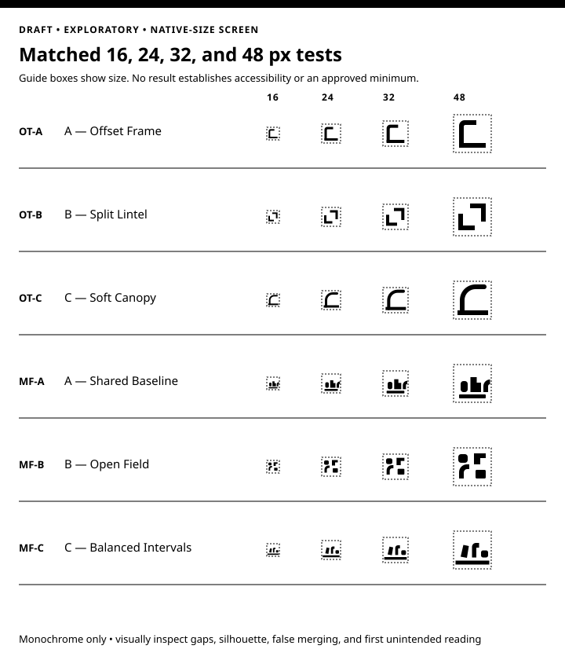

# Matched Visual Prototypes

**Status: Draft — Exploratory prototypes; not adopted or approved for public
use**

- **Date prepared:** 2026-08-23
- **Authority:** Created under Disa's authorization for Work Cycle 011
  comparison only
- **Scope:** Six original black-and-white low-fidelity symbol studies and
  equivalent application contexts for Open Threshold and Many Forms, Common
  Ground
- **Review:** Project-owner direction and internal AI-assisted design and
  validation only; Disa's final manual review is pending; no external brand,
  originality, accessibility, cultural, legal, trademark, human-factors,
  robotics, safety, or production review

> **Prototype notice:** These files are evaluation mockups. They are not an
> official identity, logo, Robot Welcome mark, safety or access symbol,
> certification, trademark claim, product asset, or authorization for public
> deployment or manufacture.

## Prototype register

Each variant receives the same nine contexts in the same 1440 by 2200 SVG
layout. The 16, 24, 32, and 48 pixel symbols inside each sheet are drawn at
those native SVG dimensions; they are provisional internal screens, not
approved minimum sizes.

### Open Threshold

1. [A — Offset Frame](open-threshold-a-offset-frame.svg)
2. [B — Split Lintel](open-threshold-b-split-lintel.svg)
3. [C — Soft Canopy](open-threshold-c-soft-canopy.svg)

### Many Forms, Common Ground

1. [A — Shared Baseline](many-forms-a-shared-baseline.svg)
2. [B — Open Field](many-forms-b-open-field.svg)
3. [C — Balanced Intervals](many-forms-c-balanced-intervals.svg)

The [native small-size contact
sheet](native-small-size-contact-sheet.svg) places all six symbols under the
same conditions.



The accompanying [matched prototype evaluation](../matched-prototype-evaluation.md)
records intended meaning, foreseeable misreadings, relational-warmth review,
gates, limitations, and owner decisions.

## Equivalent contexts

Every variant sheet contains, in the same order and dimensions:

1. black symbol and project name on white;
2. white symbol and project name on black;
3. provisional 16, 24, 32, and 48 pixel tests, plus a small name lockup;
4. a Draft research-report cover;
5. a content-heavy website header and page section;
6. an evaluation-only campaign tile with a claim, qualifier, and source area;
7. one-color merchandise feasibility examples;
8. a Robot Welcome separation diagram using plain text rather than proposed
   operational markings; and
9. an unresolved confusion-review panel.

The presentation deliberately avoids color polish, animation, photography,
and production effects so neither direction gains an advantage through mockup
quality.

## Construction and provenance

The symbols and layouts are original geometric constructions created for Work
Cycle 011. They are not copied or traced from stock art, an icon library, a
template, or another identity. The SVGs contain:

- only local vector paths, rectangles, lines, text, and internal SVG `use`
  references;
- no raster images, external links, remote styles, scripts, metadata from a
  design platform, embedded font files, or third-party assets;
- generic `sans-serif` text as an explicitly untested placeholder rather than
  a selected typeface; and
- black, white, and neutral gray only, with meaning carried in text, shape,
  spacing, fill, and line.

This provenance statement records the construction method. It is not evidence
of trademark availability, legal originality, distinctive character, freedom
to operate, or absence of confusing similarity. Those questions remain
unreviewed.

## Regeneration

[`generate_prototype_sheets.py`](generate_prototype_sheets.py) is the source
for all seven SVGs and uses only the Python standard library. From the
repository root, run:

```text
python3 docs/brand/prototypes/generate_prototype_sheets.py
```

Generation is deterministic. Review the resulting diff and rerun the SVG,
link, small-size, and visual checks before relying on a regenerated file.

## Use boundary

Do not extract a symbol from these sheets for a website, social profile,
campaign, document release, product, garment, robot, site, safety system,
access system, certification programme, or trademark filing. A later owner
decision must name the exact variant and next stage, and the review must be
proportionate to that stage.

The Robot Welcome diagrams demonstrate separation only. They do not propose a
Robot Welcome mark or placement on a robot, and they do not assess any exact
machine, environment, warning, control, sensor, material, or applicable
standard.
